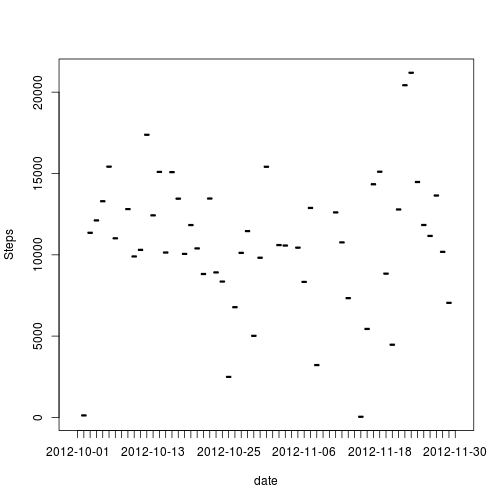
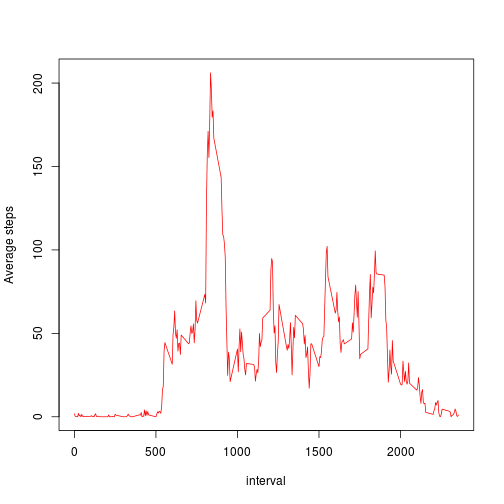
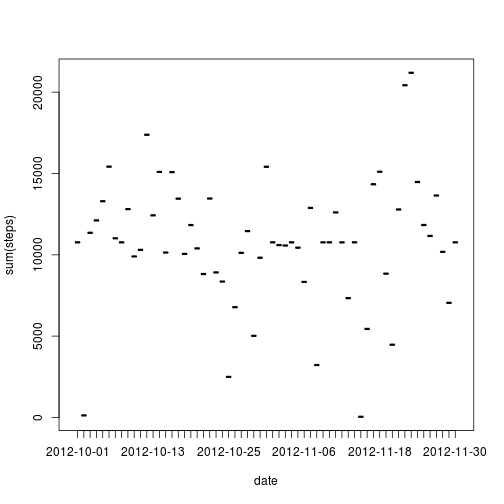
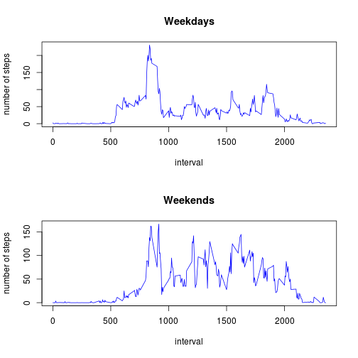

Loading and preprocessing the data

```r
mydata <- read.table("activity.csv", sep = ",", header = T)
```

Loading necessary libraries and doing some subsetting

```r
library(plyr)
library(dplyr)
## count all steps by day
steps_by_day <- summarise(group_by(mydata, date), sum(steps))
```

What is mean total number of steps taken per day?


```r
#Plot steps by day
plot(steps_by_day, type = "h", ylab = "Steps")
```



```r
## get the step mean and median for each day
steps_mean <- summarise(group_by(mydata, date), mean(steps))
steps_median <- summarise(group_by(mydata, date), median(steps))
```

What is the average daily activity pattern?


```r
steps_by_interval <- ddply(mydata, c("interval"), summarise, mean(steps, na.rm = T))
plot(steps_by_interval, type = "l", col = "red", ylab = "Average steps")
```



Which 5-minute interval, on average across all the days in the dataset, contains the maximum number of steps?


```r
steps_by_interval[which.max(steps_by_interval$`mean(steps, na.rm = T)`),]
```

```
##     interval mean(steps, na.rm = T)
## 104      835               206.1698
```

The interval with average max steps is 835.

Imputing missing values.

Calculate and report the total number of missing values in the dataset (i.e. the total number of rows with NAs)

```r
sum(is.na(mydata$steps))
```

```
## [1] 2304
```
Missing values : 2304

For replacing NA values, we use mean of the day.

```r
x <- mydata
for (i in 1:17568){
    if (is.na(x[i, 1])){
        intervalo <- x[i, 3]
        prom <- steps_by_interval[steps_by_interval$interval == intervalo, 2]
        x[i, 1] = prom
        }
}
```
The new data set

```r
# x
```

Mean and media for new dataset


```r
x_mean <- summarise(group_by(x, date), mean(steps))
x_median <- summarise(group_by(x, date), median(steps))
```


Steps by day, with new dataset


```r
x_by_day <- summarise(group_by(x, date), sum(steps))
plot(x_by_day)
```



Looking the last graphic, it seems to be low difference between two datasets.

Are there differences in activity patterns between weekdays and weekends?

Create new dataframe with extra column weekday or weekend

```r
what_day <- function(z){
    if ((weekdays(as.Date(z)) == "sábado") || (weekdays(as.Date(z)) == "domingo")){
        return("weekend")
        }
    else{
        return("weekday")
        }
}
x["day"] <- 0
x$day <- lapply(x$date, what_day)
```

Make a plot by type of day

```r
steps_weekend <- subset(x, day == "weekend")
steps_weekday <- subset(x, day == "weekday")
swd <- ddply(steps_weekday, c("interval"), summarise, mean(steps, na.rm = T))
swe <- ddply(steps_weekend, c("interval"), summarise, mean(steps, na.rm = T))
par(mfrow = c(2, 1))
plot(swd, type = "l", col = "blue", ylab = "number of steps", main = "Weekdays")
plot(swe, type = "l", col = "blue", ylab = "number of steps", main = "Weekends")
```



```r
dev.off
```

```
## function (which = dev.cur()) 
## {
##     if (which == 1) 
##         stop("cannot shut down device 1 (the null device)")
##     .External(C_devoff, as.integer(which))
##     dev.cur()
## }
## <bytecode: 0x8c5cb78>
## <environment: namespace:grDevices>
```

Finally, we can see there is a different behavior on weekends compared with weekdays.


